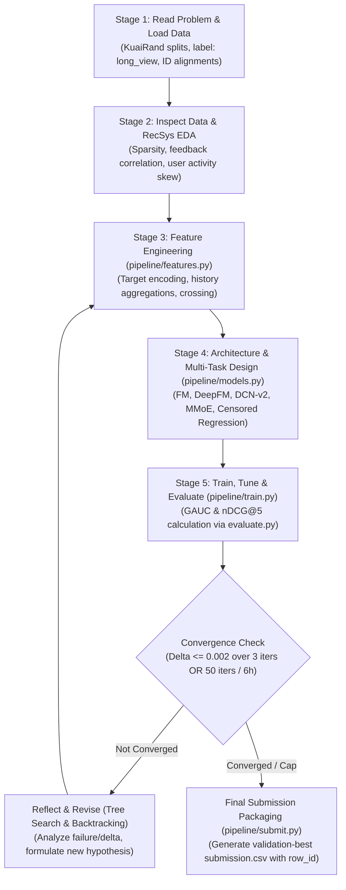

# RankAgent: Autonomous ML Research Agent for Recommender Systems

[](LICENSE)
[](https://www.python.org/)
[](https://kuairand.com)
[]()

> **RankAgent** is an LLM-driven autonomous machine learning research agent engineered specifically for recommender system (RecSys) ranking problems. Given a tabular/interaction dataset and target metrics, RankAgent autonomously drives the closed-loop cycle of problem formulation, exploratory data analysis, feature engineering, architecture search & multi-task modeling, training/tuning, and rigorous offline evaluation with self-healing reflection.

---

## 📌 Table of Contents
- [1. Project Overview & State Machine](#1-project-overview--state-machine)
- [2. System Architecture & Subsystem Ownership](#2-system-architecture--subsystem-ownership)
- [3. Benchmark & Metric Specification](#3-benchmark--metric-specification)
- [4. Repository & File Partitioning](#4-repository--file-partitioning)
- [5. Setup & Autonomous Execution Guide](#5-setup--autonomous-execution-guide)
- [6. Evaluation, Convergence & Submission](#6-evaluation-convergence--submission)
- [7. 3-Day Hackathon Roadmap](#7-3-day-hackathon-roadmap)
- [8. Documentation Index](#8-documentation-index)

---

## 1. Project Overview & State Machine

Machine learning engineering for recommendation systems (e.g., short-video CTR/long-view prediction) is inherently cyclic. RankAgent automates this entire loop without human intervention by operating as a finite state machine backed by agentic tree search:

$$\text{INIT} \longrightarrow \text{HYPOTHESIZE} \longrightarrow \text{GENERATE} \longrightarrow \text{RUN} \longrightarrow \text{EVAL} \longrightarrow \text{REFLECT / PRUNE} \longrightarrow \text{HALT}$$



---

## 2. System Architecture & Subsystem Ownership

```
+-----------------------------------------------------------------------------------+
|                        MEMBER 1: Tree Search Orchestrator                         |
|   State Machine: INIT -> HYPOTHESIZE -> GENERATE -> RUN -> EVAL -> REFLECT/PRUNE  |
|   Convergence Trigger: Halts if primary score improvement < 0.002 over 3 iters    |
+--------------------+------------------------------------+-------------------------+
                     |                                    |
                     v                                    v
+------------------------------------+   +------------------------------------------+
| MEMBER 3: Prompt Engine & KB       |   | MEMBER 2: Execution Sandbox & Telemetry  |
| - KuaiRand KB (Duration Bias, MTL) |   | - Subprocess Runner with 6-hour ceiling  |
| - Hypothesis Generator             |   | - Parse GAUC & nDCG@5 from evaluate.py   |
| - Code Generation Prompts          |   | - Self-Healing Loop (Max 3 retries)      |
| - Debugger & Reflection Templates  |   | - run_summary.json Telemetry Tracker     |
+--------------------+---------------+   +--------------------+---------------------+
                     |                                        |
                     +-------------------+--------------------+
                                         |
                                         v
+-----------------------------------------------------------------------------------+
|               MEMBER 4: Modularized KuaiRand Pipeline (pipeline/)                 |
| - data.py (Strict Date-Based Splits: Train 0408-0421, Val 0422-0428)              |
| - features.py (12 Auxiliary Signals, Dense/Sparse Embeddings)                     |
| - models.py (Agent-modified: FM -> DeepFM -> Multi-Task Architectures)            |
| - train.py (Loss Balancing for `long_view` + auxiliary tasks)                     |
| - evaluate.py (Official Starter Kit Evaluator: GAUC, nDCG@5, Submission CSV)      |
| - submit.py (Strict row_id, user_id, video_id, score CSV Exporter)                |
+-----------------------------------------------------------------------------------+
```

---

## 3. Benchmark & Metric Specification

### 3.1 KuaiRand-Pure Benchmark (Primary Required)
* **Domain**: Short-video recommendation feed (Kuaishou KuaiRand-Pure dataset).
* **Interactions**: ~1.4M logged interactions (27,285 users $\times$ 7,583 items).
* **Feedback Signals**: 12 signals (`click`, `like`, `follow`, `comment`, `forward`, `long_view`, `play_time`, etc.).
* **Target Label**: `long_view` (binary native column).
* **Splits (Date-based)**:
  * **Train**: `2022-04-08` to `2022-04-21` (1,141,112 rows)
  * **Validation**: `2022-04-22` to `2022-04-28` (124,909 rows)
  * **Hidden Test**: `2022-04-29` to `2022-05-08` (170,588 rows)

### 3.2 Target Metrics & Baseline Score
* **Evaluation Metrics**:
  * $\text{GAUC}$: Per-user AUC weighted by positive count ($0 < \text{positives} < \text{impressions}$).
  * $\text{nDCG@5}$: Discounted cumulative gain ($2^{\text{rel}} - 1$) within user impressions; users with 0 positives scored as 0.
  * $\text{Primary Score} = \frac{\text{GAUC} + \text{nDCG@5}}{2}$.
* **Official Baseline**: Factorization Machine ($k=16, \text{lr}=0.001$, 5 categorical fields, NumPy CPU ~40s).
  * Validation: $\text{GAUC} = 0.6674 \mid \text{nDCG@5} = 0.5357 \mid \mathbf{\text{Primary} = 0.6016}$.
  * Hidden-Test: $\text{GAUC} = 0.6610 \mid \text{nDCG@5} = 0.5282 \mid \mathbf{\text{Primary} = 0.5946}$.
  * Attainable theoretical ceiling: $\mathbf{\text{Primary} = 0.8645}$.

---

## 4. Repository & File Partitioning

```
RankAgent/
├── README.md                      # This project overview & roadmap
├── requirements.txt               # PyTorch, LightGBM, Pandas, Pydantic, LLM SDKs
├── configs/
│   ├── agent_config.yaml          # Search budget (50 iters, 6h cap) & debugger settings
│   └── benchmark_kuairand.yaml    # KuaiRand dataset splits and metric rules
├── orchestrator/                  # MEMBER 1: State Machine & Search
│   ├── state_machine.py           # FSM loop controller
│   ├── tree_manager.py            # Non-linear tree search & robust convergence tracker
│   └── schemas.py                 # Pydantic data contracts (MetricResult, ExecutionResult)
├── sandbox/                       # MEMBER 2: Execution & Telemetry
│   ├── runner.py                  # Subprocess runner with 6-hour ceiling
│   ├── parser.py                  # Regex parser for [EVAL] GAUC & nDCG@5
│   ├── debugger.py                # Self-healing loop (max 3 retries)
│   └── logger.py                  # run_summary.json telemetry writer
├── prompts/                       # MEMBER 3: Domain KB & Prompts
│   ├── templates.py               # Hypothesis & code diff prompt templates
│   └── recsys_kb.py               # Prompt-ready KuaiRand RecSys playbook
├── pipeline/                      # MEMBER 4: Modular Target Pipeline
│   ├── data.py                    # Date-based train/val split loader
│   ├── features.py                # Feature transforms & target encodings
│   ├── models.py                  # Model architectures (FM, DeepFM, MMoE)
│   ├── train.py                   # Loss balancing & training loop
│   ├── evaluate.py                # Official starter kit evaluation script
│   └── submit.py                  # Strict row_id submission formatter
├── logs/                          # Run artifacts, JSON logs, and markdown journals
└── docs/                          # Architecture, Strategy, Run-Log Spec, Devpost report
```

---

## 5. Setup & Autonomous Execution Guide

### 5.1 Installation
```bash
git clone https://github.com/albertusashali/RankAgent.git
cd RankAgent
pip install -r requirements.txt
```

### 5.2 Launching Autonomous Run
```bash
# Verify official starter baseline
python pipeline/evaluate.py

# Launch autonomous optimization loop
python -m orchestrator.state_machine \
  --config configs/benchmark_kuairand.yaml \
  --max-iterations 50 \
  --max-wall-clock 21600 \
  --convergence-epsilon 0.002 \
  --convergence-patience 3
```

---

## 6. Evaluation, Convergence & Submission

### 6.1 Convergence Criterion
A run automatically terminates when:
$$\Delta \text{Score}_{\text{val}} \le \varepsilon = 0.002 \quad \text{for } N = 3 \text{ consecutive iterations}$$
or when the run hits the **50-iteration cap** or **6-hour wall-clock ceiling**.

### 6.2 Strict Submission Verification
Submission files are validated against the strict starter-kit protocol:
```bash
# Validates header (row_id,user_id,video_id,score), row count (170,588), row_id alignment, and NaN check
python pipeline/submit.py --check --file submissions/submission_best.csv
```

---

## 7. 3-Day Hackathon Roadmap

| Phase | Orchestrator & Sandbox (M1 & M2) | Prompts & Target ML Pipeline (M3 & M4) |
| :--- | :--- | :--- |
| **Day 1** | Implement Pydantic data contracts, FSM state machine, and convergence tracker. | Stand up FM Starter Kit baseline in `pipeline/`. Verify date splits & evaluation metrics. |
| **Day 2** | Implement Subprocess Runner (6h ceiling), regex parser, and 3-retry self-healing debugger. | Author `prompts/recsys_kb.py` focusing on MMoE, 12 feedback signals, and CWM duration bias. |
| **Day 3** | Run full 50-iteration autonomous exploration loop; monitor telemetry logs. | Generate final `submission.csv` via `submit.py`; finalize Devpost summary & record 3-min video. |

---

## 8. Documentation Index

* [`docs/ARCHITECTURE_DESIGN.md`](docs/ARCHITECTURE_DESIGN.md): Detailed subsystem designs, Pydantic schemas, and state machine workflows.
* [`docs/EXPERIMENT_STRATEGY.md`](docs/EXPERIMENT_STRATEGY.md): Phased RecSys exploration roadmap and prompt-ready domain playbook.
* [`docs/RUN_LOG_SPEC.md`](docs/RUN_LOG_SPEC.md): Standardized JSON and Markdown schemas for hackathon run-logs.
* [`docs/DEVPOST_SUBMISSION.md`](docs/DEVPOST_SUBMISSION.md): Complete hackathon project description and results template.
