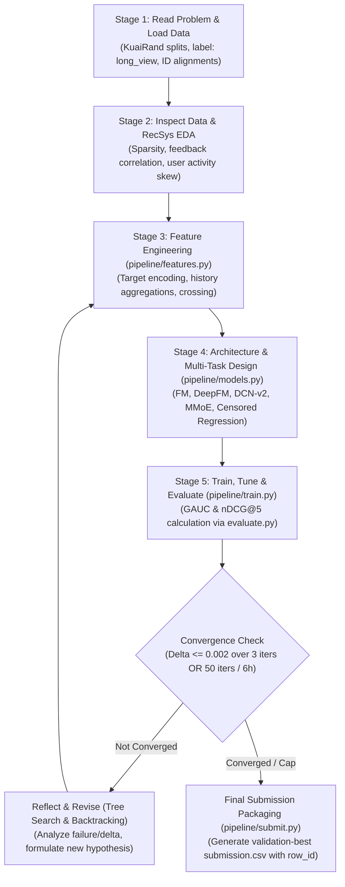

# RankAgent: Autonomous ML Research Agent for Recommender Systems

[](LICENSE)
[](https://www.python.org/)
[](https://kuairand.com)
[]()
[]()

> **RankAgent** is an LLM-driven autonomous machine learning research agent engineered specifically for recommender system (RecSys) ranking problems. Given a tabular/interaction dataset and target metrics, RankAgent autonomously drives the closed-loop cycle of problem formulation, exploratory data analysis, feature engineering, architecture search & multi-task modeling, training/tuning, and rigorous offline evaluation with self-healing reflection.

---

## 📌 Table of Contents
- [1. Project Overview & State Machine](#1-project-overview--state-machine)
- [2. System Architecture — Four Specialised Agents](#2-system-architecture--four-specialised-agents)
- [3. Benchmark & Metric Specification](#3-benchmark--metric-specification)
- [4. Repository & File Partitioning](#4-repository--file-partitioning)
- [5. Setup & Reproduction](#5-setup--reproduction)
- [6. Evaluation, Convergence & Submission](#6-evaluation-convergence--submission)
- [7. Status & Remaining Work](#7-status--remaining-work)
- [8. Documentation Index](#8-documentation-index)

---

## 1. Project Overview & State Machine

Machine learning engineering for recommendation systems (e.g., short-video CTR/long-view prediction) is inherently cyclic. RankAgent automates this entire loop without human intervention by operating as a finite state machine backed by agentic tree search:

$$\text{INIT} \longrightarrow \text{HYPOTHESIZE} \longrightarrow \text{GENERATE} \longrightarrow \text{RUN} \longrightarrow \text{EVAL} \longrightarrow \text{REFLECT / PRUNE} \longrightarrow \text{HALT}$$



---

## 2. System Architecture — Four Specialised Agents

RankAgent runs its loop as four agents coordinating over a shared **blackboard**,
rather than one prompt doing domain reasoning, code generation and debugging at once.

```
        ┌──────────────────────────────────────────────┐
        │            Product Manager Agent             │   owns COVERAGE
        │   which axis to work on; when to rotate      │   runs every N iters
        └───────────────────────┬──────────────────────┘
        ┌───────────────────────▼──────────────────────┐
        │             ML Research Agent                │   owns HYPOTHESES
        │   what to try, and the mechanism why         │   k per call
        └───────────────────────┬──────────────────────┘
        ┌───────────────────────▼──────────────────────┐
        │            Engineer (SWE) Agent              │   owns RUNNABILITY
        │   validates against the REAL argparse spec   │   rejects duplicates
        └───────────────────────┬──────────────────────┘
        ┌───────────────────────▼──────────────────────┐
        │            QA & Debugger Agent               │   owns TRUST
        │   pre-flight, result verdicts, self-healing  │
        └──────────────────────────────────────────────┘

              all four read/write one ResearchContext
```

**Why a blackboard, not a pipeline.** In a chain each handoff is a lossy
paraphrase. An earlier single-agent run logged a hypothesis about DCN-v2 while
executing `--model mmoe`; a four-stage chain would give that drift three more
places to happen. Here agents exchange typed objects, never prose.

**What each role prevents.** Every split is traceable to a logged failure:

| Role | Failure it prevents |
| :--- | :--- |
| Product Manager | A run that spent 4 iterations on one axis and **never varied the loss** — the strongest measured lever. Tracks 7 dimensions, directs at untried ones, rotates when stalled. |
| Researcher | Hypotheses without mechanisms; re-deriving the organizers' measured dead ends. |
| Engineer | A logged hypothesis that doesn't match the command that ran. Every command is parsed against the real spec and checked against history. |
| QA | Trusting a broken result. Rejects scores below the random floor (0.4834) or above the oracle ceiling (0.8484). |

**Cost control.** Naively four calls per iteration would push the run into the
most expensive Feasibility tier for no gain. The PM runs every 3 iterations, the
Researcher returns several hypotheses per call, and Engineer and QA only call out
on failure. A measured 5-iteration run used **7 calls, 8,774 tokens** — roughly
1.4 calls per iteration — attributed per role in `RunSummary.cost_by_agent`.

**Without an API key** every agent has a deterministic fallback and the whole team
runs at zero tokens, covering all 7 dimensions in 10 iterations.

Full detail: [`docs/AGENT_ARCHITECTURE.md`](docs/AGENT_ARCHITECTURE.md).

### Supporting subsystems

```
orchestrator/   FSM loop, exploration tree, convergence rule, Pydantic contracts
sandbox/        subprocess runner (one framework per process), parser, logger
pipeline/       data (hidden-test sealed), features (causal), models, train, submit
agents/         the four roles + blackboard + playbook
```

---

## 3. Benchmark & Metric Specification

### 3.1 KuaiRand-Pure Benchmark (Primary Required)
* **Domain**: Short-video recommendation feed (Kuaishou KuaiRand-Pure dataset).
* **Interactions**: ~1.4M logged interactions (27,285 users $\times$ 7,583 items).
* **Feedback Signals**: 12 signals (`click`, `like`, `follow`, `comment`, `forward`, `long_view`, `play_time`, etc.).
* **Target Label**: `long_view` (binary native column).
* **Splits (Date-based)**:
  * **Train**: `2022-04-08` to `2022-04-21` (1,141,112 rows)
  * **Validation**: `2022-04-22` to `2022-04-28` (124,909 rows)
  * **Hidden Test**: `2022-04-29` to `2022-05-08` (170,588 rows)

### 3.2 Target Metrics & Baseline Score
* **Evaluation Metrics**:
  * $\text{GAUC}$: Per-user AUC weighted by positive count ($0 < \text{positives} < \text{impressions}$).
  * $\text{nDCG@5}$: Discounted cumulative gain ($2^{\text{rel}} - 1$) within user impressions; users with 0 positives scored as 0.
  * $\text{Primary Score} = \frac{\text{GAUC} + \text{nDCG@5}}{2}$.
* **Official Baseline**: Factorization Machine ($k=16, \text{lr}=0.001$, 5 categorical fields, NumPy CPU ~40s).
  * Validation: $\text{GAUC} = 0.6674 \mid \text{nDCG@5} = 0.5357 \mid \mathbf{\text{Primary} = 0.6016}$.
  * Hidden-Test: $\text{GAUC} = 0.6610 \mid \text{nDCG@5} = 0.5282 \mid \mathbf{\text{Primary} = 0.5946}$.
  * Attainable theoretical ceiling: $\mathbf{\text{Primary} = 0.8645}$.

---

## 4. Repository & File Partitioning

```
RankAgent/
├── README.md                      # This project overview & roadmap
├── requirements.txt               # PyTorch, LightGBM, Pandas, Pydantic, LLM SDKs
├── configs/
│   ├── agent_config.yaml          # Search budget (50 iters, 6h cap) & debugger settings
│   └── benchmark_kuairand.yaml    # KuaiRand dataset splits and metric rules
├── orchestrator/                  # MEMBER 1: State Machine & Search
│   ├── state_machine.py           # FSM loop controller
│   ├── tree_manager.py            # Non-linear tree search & robust convergence tracker
│   └── schemas.py                 # Pydantic data contracts (MetricResult, ExecutionResult)
├── sandbox/                       # MEMBER 2: Execution & Telemetry
│   ├── runner.py                  # Subprocess runner with 6-hour ceiling
│   ├── parser.py                  # Regex parser for [EVAL] GAUC & nDCG@5
│   ├── debugger.py                # Self-healing loop (max 3 retries)
│   └── logger.py                  # run_summary.json telemetry writer
├── prompts/                       # MEMBER 3: Domain KB & Prompts
│   ├── templates.py               # Hypothesis & code diff prompt templates
│   └── recsys_kb.py               # Prompt-ready KuaiRand RecSys playbook
├── pipeline/                      # MEMBER 4: Modular Target Pipeline
│   ├── data.py                    # Date-based train/val split loader
│   ├── features.py                # Feature transforms & target encodings
│   ├── models.py                  # Model architectures (FM, DeepFM, MMoE)
│   ├── train.py                   # Loss balancing & training loop
│   ├── evaluate.py                # Official starter kit evaluation script
│   └── submit.py                  # Strict row_id submission formatter
├── logs/                          # Run artifacts, JSON logs, and markdown journals
└── docs/                          # Architecture, Strategy, Run-Log Spec, Devpost report
```

---

## 5. Setup & Reproduction

Every step below is a `make` target, verified on a clean clone (macOS, Python 3.14, CPU only).

```bash
git clone https://github.com/albertusashali/RankAgent.git
cd RankAgent

make venv        # .venv + dependencies
make data        # download and extract KuaiRand-Pure (~1.4M interactions)
make sanity      # harness self-check: random scoring must reach test primary ~0.4753
make test        # 16 tests: scorer parity, hidden-test seal, leak regressions, convergence
make baseline    # reproduce the official FM baseline -> valid primary 0.6015
make agent       # run the autonomous loop end to end
```

**Verified output.**

| Step | Expected | Measured |
| :--- | :--- | :--- |
| `make sanity` | test primary ~ 0.4753 | 0.4757 |
| `make baseline` | valid primary 0.6016 | **0.6015** (epoch-for-epoch identical to the starter kit) |
| `make test` | all pass | 16 passed |

### 5.1 Training a single model

```bash
python -m pipeline.train --model fm_torch --loss listwise --epochs 15
python -m pipeline.train --model mmoe --loss listwise --experts 4 --epochs 12
python -m pipeline.train --model lgb --objective lambdarank --trees 400
```

`--model` accepts `fm | fm_torch | deepfm | din | mmoe | lgb`; `--loss` accepts
`pointwise | listwise | bpr`. Each run writes `checkpoints/<name>.meta.json` recording its
exact constructor arguments, so the submission step rebuilds the model rather than guessing.

> **Note on PyTorch and LightGBM.** The two vendor conflicting OpenMP runtimes and segfault
> if both are loaded into one process, in either import order. Neither is imported at module
> scope; each trainer imports only what it needs, and every trial runs in its own subprocess.
> Ensembling across the two families therefore goes through cached predictions
> (`--export`), not a shared process.

---

## 6. Evaluation, Convergence & Submission

### 6.1 The scorer is the official scorer

`pipeline/evaluate.py` contains no metric implementation. It loads
`kuairand-starter-kit/evaluate.py` verbatim, so the score we select on is byte-identical to
the score we are ranked on. `tests/test_harness.py` asserts this and pins the tie-handling
behaviour that a reimplementation gets wrong.

### 6.2 The hidden test set is sealed in code

The challenge requires the agent develop on train + validation only. That is enforced, not
merely intended:

* `load_kuairand()` returns **train and valid only**.
* `include_test=True` returns test rows with `label = -1` — features, never targets.
* Real test labels require `RANKAGENT_UNSEAL_TEST=1`, which the runner explicitly strips
  from every trial's environment.

An iteration that tries to select on test performance fails loudly instead of leaking.

### 6.3 Convergence

A run halts when validation primary has not improved by more than eps = 0.002 over the last
N = 3 iterations — a property of the *best-so-far curve*, not of a single iteration — or on
the 50-iteration cap or 6-hour ceiling.

### 6.4 Submission

```bash
# score each model in its own process, then blend on validation
python -m pipeline.submit --export --checkpoint fm_torch_listwise
python -m pipeline.submit --export --checkpoint mmoe
python -m pipeline.submit --generate --checkpoint fm_torch_listwise mmoe \
    --file submissions/kuairand_pure_final.csv

# validate against the organizer's own checker
cd kuairand-starter-kit && python submit.py --check --split test \
    ../submissions/kuairand_pure_final.csv --data_dir ../data/KuaiRand-Pure/data
```

The final file passes both our checker and the starter kit's: 170,588 rows, correct header,
contiguous `row_id`, and row-for-row `user_id`/`video_id` alignment.

### 6.5 Results

Measured on validation; see [`docs/DEVPOST_SUBMISSION.md`](docs/DEVPOST_SUBMISSION.md) for the
full table and [`logs/run_summary.json`](logs/run_summary.json) for the run record.

| | Valid primary | Delta vs baseline |
| :--- | ---: | ---: |
| Official FM baseline | 0.6015 | 0.0000 |
| FM, pointwise BCE (control) | 0.6011 | -0.0004 |
| FM, within-user listwise softmax | 0.6024 | +0.0009 |
| MMoE, listwise | 0.6021 | +0.0006 |
| **Rank-blend (FM-listwise 0.45 / MMoE 0.55)** | **0.6040** | **+0.0025** |

Hidden-test scores are deliberately absent: the agent cannot compute them.

---

## 7. Status & Remaining Work

**Done.** Baseline reproduces exactly; the scorer is the official one; the hidden-test seal is
enforced in code and tested; the two label leaks (DIN history, target encoding) are fixed and
covered by regression tests; the loop survives failures and recovers from them; telemetry is
real; the submission passes the organizer's checker.

**Open**, in priority order — see [`docs/AUDIT_AND_PLAN.md`](docs/AUDIT_AND_PLAN.md):

1. **Multi-seed acceptance gating.** +0.0025 is barely 3 sigma; no gain is defensible on one seed.
2. **A real code action space.** The agent selects among curated hypotheses over an existing
   trainer rather than writing Python. This is the largest gap against the brief.
3. **Unbiased validation** against the randomised-exposure log (already exposed by the loader).
4. **Censored watch-time regression.** `play_time_ms` is loaded and still unused as a target.

---

## 8. Documentation Index

* [`docs/AGENT_ARCHITECTURE.md`](docs/AGENT_ARCHITECTURE.md): The four-agent design, the blackboard, and the measured failure each role prevents.
* [`docs/ARCHITECTURE_DESIGN.md`](docs/ARCHITECTURE_DESIGN.md): Detailed subsystem designs, Pydantic schemas, and state machine workflows.
* [`docs/EXPERIMENT_STRATEGY.md`](docs/EXPERIMENT_STRATEGY.md): Phased RecSys exploration roadmap and prompt-ready domain playbook.
* [`docs/RUN_LOG_SPEC.md`](docs/RUN_LOG_SPEC.md): Standardized JSON and Markdown schemas for hackathon run-logs.
* [`docs/DEVPOST_SUBMISSION.md`](docs/DEVPOST_SUBMISSION.md): Complete hackathon project description and results template.
