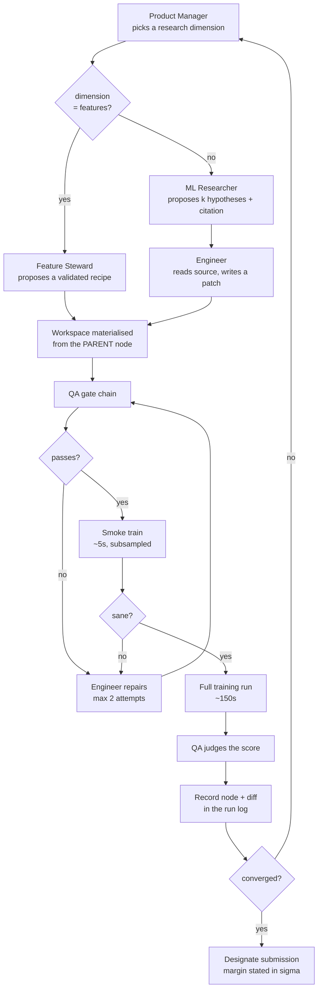
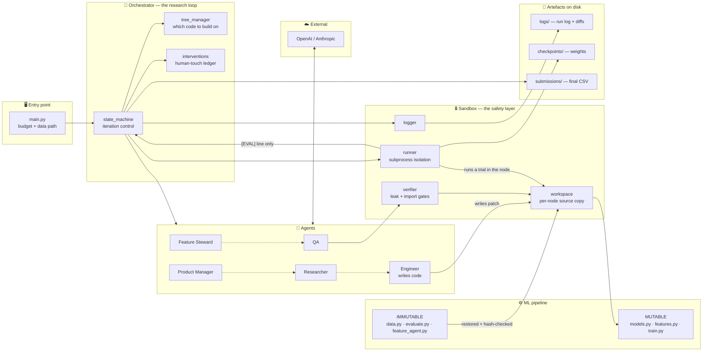
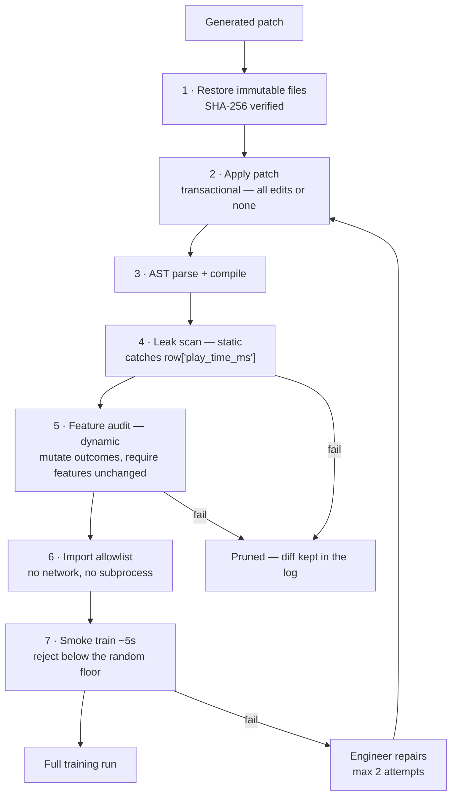
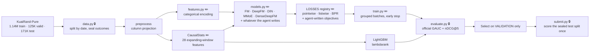

# System Architecture

RankAgent is a **local, headless research agent** — a Python CLI that writes and
runs machine-learning code. It is not a web application, so several rows of the
standard architecture template do not apply. They are listed as **N/A** with the
reason rather than omitted, so nothing looks overlooked.

---

## 🛠️ Core Components

| Layer | What we use | Notes |
| :--- | :--- | :--- |
| **Frontend** | **N/A** — terminal CLI | Output is a live console log plus two artefacts: `logs/run_log.md` (human) and `logs/run_summary.json` (machine). `scripts/inspect_run.py` renders a summary |
| **Backend** | **Python 3.11+** | `main.py` → `orchestrator.state_machine`. No server: a run is one long-lived process that supervises short-lived child processes |
| **Database** | **N/A** — filesystem | State is append-structured JSON + Markdown under `logs/`, per-node source trees under `workspaces/`, model weights under `checkpoints/`. A run must be auditable from a git checkout with no service running |
| **Cloud infrastructure** | **N/A** — runs on a laptop | CPU only, ~4 GB RAM, 10–40 min per run. The only network calls are to the LLM provider |
| **ML stack** | PyTorch 2.1, LightGBM 4.1, NumPy, scikit-learn | Torch and LightGBM **cannot share a process** (conflicting OpenMP runtimes → segfault), which is why every trial runs in its own interpreter |
| **Validation** | Pydantic v2 | Every agent boundary is a typed contract; a malformed model response is rejected whole rather than partially applied |

### Why five agents

| Agent | Owns | Calls the LLM |
| :--- | :--- | :--- |
| Product Manager | coverage across 7 research dimensions | every 3 iterations, or on stall |
| ML Researcher | hypotheses + a cited method | once per iteration |
| Engineer | writing and repairing source patches | once per iteration, plus repairs |
| Feature Steward | the feature space; leakage audits | only when the PM targets `features` |
| QA | pre-flight, gates, result verdicts | only when a trial breaks |

Roughly **two model calls per iteration**, not five. Every role has a
deterministic fallback, so the whole system runs at zero tokens.

---

## 🔄 Data Flow & Logic

**User input.** One command with a budget: `python main.py --data_dir <path>
--max_iterations 30`. There is no interaction after launch — that is the point.
Every operator-supplied flag is recorded in an intervention ledger, because
autonomy is scored on how little human input a run needed.

**API layer.** Not REST or GraphQL. Two boundaries:
- **LLM API** — HTTPS to OpenAI or Anthropic. Typed request, typed response,
  token usage read from the response rather than estimated.
- **Process boundary** — `subprocess` with a pinned working directory and a
  filtered environment. Every experiment crosses it. The only channel back is
  one line on stdout: `[EVAL] GAUC: … | nDCG@5: … | Primary: …`, so a trial
  cannot return anything but a validation metric.

**External APIs.** OpenAI / Anthropic for reasoning. Nothing else — trials have
no network access and the import allowlist blocks `requests`, `socket` and
`urllib`.

**Processing.** All computation is local. Model training dominates wall clock
(~150 s per full trial, ~5 s per smoke trial).

### One iteration, end to end

**Legend** — rectangles are actions, diamonds are decisions. The loop from *QA
gate* → *repair* → *gate* is the self-healing path: generated code that fails is
handed its own traceback and fixed, rather than discarded. The smoke train sits
before the full run so a bad patch costs **5 seconds instead of 150**.

---

## 🎨 Visual Architecture Diagram

**Legend**
- **Solid arrows** — data or control flow.
- **Dotted arrows** — one agent hands a typed object to the next.
- **🔒 Sandbox** is the trust boundary: everything the agent writes passes
  through it before it executes.
- **MUTABLE** is what the agent may rewrite. **IMMUTABLE** is restored from the
  canonical repository and SHA-256-verified before *every* run.

---

## 🚀 Key Technical Highlights

### Authentication — N/A, but credentials are handled

No user accounts: a run is launched by whoever has the machine. The one secret
is the LLM API key, read from `.env` and **stripped from every trial's
environment**. That matters specifically because the agent writes the code that
runs in those subprocesses — inheriting the parent environment would be a live
exfiltration path out of a process launched with `shell=True`.

### Scalability — process isolation, not horizontal scale

Not a serving system, so no load to spread. The scaling concerns that are real:

- **Per-trial isolation.** Every experiment is its own interpreter with its own
  process group, so a segfault or a timeout costs one iteration rather than the
  run. Timeouts kill the whole group, so a killed trainer cannot be orphaned.
- **Cost control.** ~2 LLM calls per iteration, not 5. Prompts send an
  AST-derived *outline* of the mutable surface and the full text of only the file
  being edited.
- **Wall clock is the binding constraint**, not tokens — a 30-iteration run costs
  roughly $1–3 and 10–40 minutes.

### The safety boundary — the part we would defend hardest

An agent that writes code and is scored on validation has an obvious failure
mode: write a feature that reads the label. `long_view` is ~98% determined by
`play_time_ms / duration_ms`, so a single plausible line scores brilliantly in
development and is worthless on the hidden test set.

Three layers, deliberately different in kind:

1. **The hidden test set is sealed in the loader.** Test rows arrive with every
   post-impression outcome set to `-1` — including `play_time_ms`, which was
   previously passed through ungated. A test score is not discouraged, it is
   *unavailable*.
2. **Static scan (gate 4)** matches tokens, so it catches the obvious form.
3. **Dynamic audit (gate 5)** mutates a row's own outcome columns, recomputes,
   and requires that row's feature vector to be byte-identical. This is an
   *information-flow* test, and it catches leaks the static scan cannot — a value
   reached through a helper, a rename, or a computed key. We have a regression
   test proving exactly that: static scanner 0 findings, dynamic audit FAIL.

The auditor itself (`pipeline/feature_agent.py`) is immutable. A checker the
agent can edit is not a check.

### AI/ML pipeline

**Legend** — ✏️ the agent may rewrite this. 🔒 immutable: restored and
hash-verified before every run.

Two properties worth naming:

- **Causality.** Target statistics are built by expanding window over dates, so a
  row's own label never reaches its own features. Generated code can break that
  while still running perfectly — and the validation score would go *up* — so the
  invariant is enforced by property test, not by review.
- **Registries.** A new loss is one entry in `LOSSES`; a new architecture is one
  entry in `MODELS`. Both become CLI-selectable immediately, because `--model`
  and `--loss` carry no hard-coded `choices=`. Without this, code the agent wrote
  would be unreachable no matter how good it was.

---

## Appendix — component map

| Path | Role |
| :--- | :--- |
| `main.py` | CLI entry point |
| `orchestrator/state_machine.py` | the research loop, gates, submission designation |
| `orchestrator/tree_manager.py` | which node's code the next experiment builds on |
| `orchestrator/interventions.py` | auditable ledger of every human touchpoint |
| `agents/team.py` | coordinates the five roles for one iteration |
| `agents/engineer.py`, `agents/patch.py` | writes source patches; SEARCH/REPLACE engine |
| `agents/feature_steward.py` | feature recipes and leakage audits |
| `agents/knowledge.py` | 12 methods with citations the model cannot fabricate |
| `sandbox/workspace.py` | per-node source copies; the mutable/immutable split |
| `sandbox/verifier.py` | static leak, import and syntax gates |
| `sandbox/runner.py` | subprocess isolation, env filtering, process-group kill |
| `pipeline/feature_agent.py` 🔒 | feature manifest + mutation-based leak audit |
| `pipeline/data.py` 🔒 | loader and the hidden-test seal |
| `pipeline/evaluate.py` 🔒 | delegates to the organizers' scorer |
