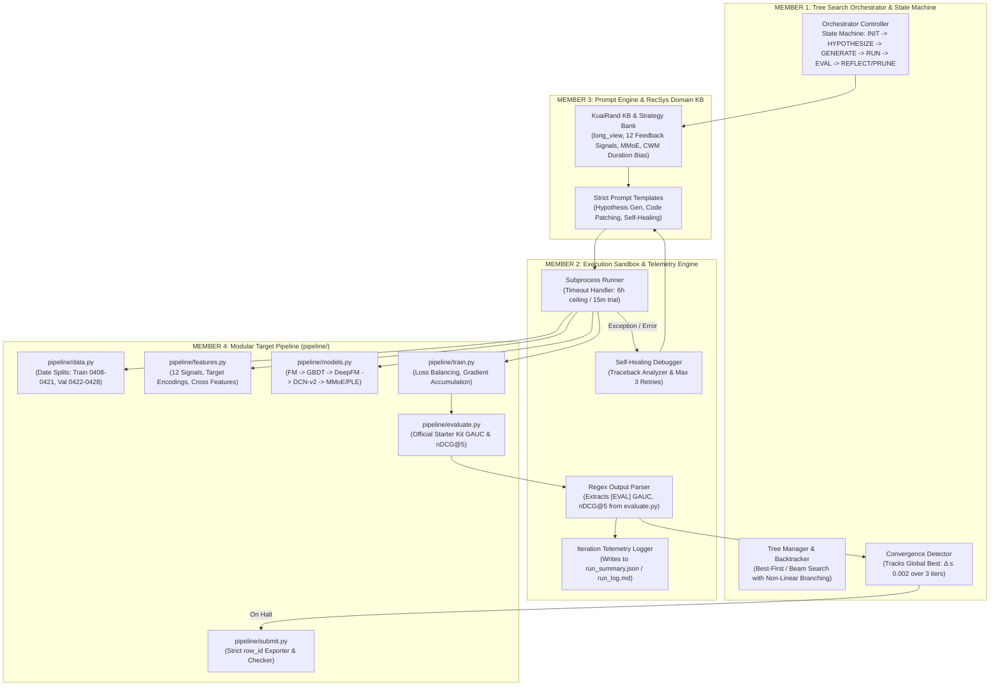

# System Architecture & Technical Design Document

**Project**: RankAgent — Autonomous Machine Learning Research Agent for Recommender Systems  
**Status**: Architectural Specification (Unified Best-of-Both Design)  
**Domain**: Autonomous LLM Agents, Recommendation Systems (Ranking), Code Generation & Tree Search  

---

## 1. System Specification & Overview

**RankAgent** is an autonomous multi-turn, state-driven framework designed to autonomously iterate on the KuaiRand-Pure short-video recommendation pipeline. It formulates hypotheses, modifies modular PyTorch/NumPy/LightGBM code, executes runs in an isolated sandbox, self-heals from runtime exceptions, and halts automatically using the official convergence rule to beat the Factorization Machine baseline.



---

## 2. Repository Layout & File Partitioning

The workspace is strictly partitioned to enforce clean modular boundaries and integrate the official Organizer Starter Kit:

```
RankAgent/
├── configs/
│   ├── agent_config.yaml          # Search algorithm, limits (50 iters, 6h ceiling)
│   └── benchmark_kuairand.yaml    # KuaiRand date splits, 12 signals, metrics
├── orchestrator/                  # MEMBER 1: State Machine & Search
│   ├── state_machine.py           # FSM controller (INIT -> HYPOTHESIZE -> ... -> PRUNE)
│   ├── tree_manager.py            # Non-linear tree search & backtrack manager
│   └── schemas.py                 # Pydantic data contracts & communication models
├── sandbox/                       # MEMBER 2: Execution & Telemetry
│   ├── runner.py                  # Subprocess execution sandbox & timeout guard
│   ├── parser.py                  # Regex parser for [EVAL] GAUC & nDCG@5
│   ├── debugger.py                # Self-healing loop (traceback -> patch, max 3 retries)
│   └── logger.py                  # run_summary.json & run_log.md telemetry writer
├── prompts/                       # MEMBER 3: Domain KB & LLM Prompts
│   ├── templates.py               # Prompt templates (Hypothesis, Diff, Fix)
│   └── recsys_kb.py               # Prompt-ready KuaiRand domain playbook
├── pipeline/                      # MEMBER 4: Target ML Pipeline (Modular Code)
│   ├── data.py                    # Loader for log_standard_...pure.csv
│   ├── features.py                # Feature extraction & historical target encoding
│   ├── models.py                  # Model definitions (FM, DeepFM, DCN-v2, MMoE)
│   ├── train.py                   # PyTorch/LightGBM training & multi-task loss
│   ├── evaluate.py                # Official starter kit evaluation script
│   └── submit.py                  # Strict row_id submission formatter & checker
├── logs/                          # Run artifacts, JSON logs, and markdown journals
└── docs/                          # Architecture, Strategy, Run-Log Spec, Devpost report
```

---

## 3. Data Contracts & Pydantic Communication Schemas

All internal communication between the Orchestrator, Sandbox, Parser, and Logger is governed by strict Pydantic schemas:

```python
# orchestrator/schemas.py
from pydantic import BaseModel, Field
from typing import Optional, Dict, Any, Literal

class MetricResult(BaseModel):
    gauc: float
    ndcg_5: float
    primary_score: float  # (gauc + ndcg_5) / 2.0
    is_converged: bool = False
    raw_stdout: Optional[str] = None

class ExecutionResult(BaseModel):
    status: Literal["SUCCESS", "RUNTIME_ERROR", "TIMEOUT", "SYNTAX_ERROR", "CONVERGENCE_HALT"]
    metrics: Optional[MetricResult] = None
    error_traceback: Optional[str] = None
    stdout_summary: str
    wall_clock_seconds: float
    command_executed: str

class IterationLogEntry(BaseModel):
    iteration_id: int
    parent_node_id: Optional[int] = None
    node_id: int
    stage: str
    hypothesis: str
    target_file: str  # e.g., "pipeline/models.py" or "pipeline/features.py"
    code_diff: str
    status: Literal["ACCEPTED", "REJECTED", "ERROR_RECOVERED", "FAILED"]
    metrics: Optional[Dict[str, float]] = None  # {"gauc": X, "ndcg_5": Y, "primary_score": Z}
    delta_over_baseline: Optional[float] = None
    error_recovery: Optional[Dict[str, Any]] = None
    prompt_tokens: int
    completion_tokens: int
    wall_clock_seconds: float
    manual_interventions: int = 0
```

---

## 4. Module 1: Orchestrator & Robust Convergence Logic

### 4.1 State Machine Lifecycle
The Orchestrator operates as a deterministic Finite State Machine (FSM):
$$\text{INIT} \longrightarrow \text{HYPOTHESIZE} \longrightarrow \text{GENERATE} \longrightarrow \text{RUN} \longrightarrow \text{EVAL} \longrightarrow \text{REFLECT / PRUNE} \longrightarrow \text{HALT}$$

### 4.2 Robust Convergence Logic
To prevent false-positive early stopping when exploratory hypotheses fail, RankAgent tracks the **consecutive stagnant iterations on the active optimization frontier**:

```python
# orchestrator/tree_manager.py
from typing import Dict, List, Optional
from orchestrator.schemas import MetricResult

class TreeManager:
    """
    Manages the exploration tree and tracks convergence on the global best validation frontier.
    """
    def __init__(self, epsilon: float = 0.002, n_convergence: int = 3, max_iterations: int = 50):
        self.epsilon = epsilon
        self.n_convergence = n_convergence
        self.max_iterations = max_iterations
        self.nodes: Dict[int, Dict] = {}
        self.best_primary_score = 0.0
        self.best_node_id: Optional[int] = None
        self.stagnant_iterations_counter = 0

    def record_iteration_result(self, node_id: int, parent_id: Optional[int], metrics: MetricResult) -> bool:
        """
        Records the metric and checks if the global search has converged.
        Returns True if early-stopping convergence is triggered.
        """
        improvement = metrics.primary_score - self.best_primary_score
        
        if improvement > self.epsilon:
            # Significant improvement found: update global best and reset counter
            self.best_primary_score = metrics.primary_score
            self.best_node_id = node_id
            self.stagnant_iterations_counter = 0
            is_converged = False
        else:
            # Stagnant or negative trial: increment counter
            self.stagnant_iterations_counter += 1
            is_converged = self.stagnant_iterations_counter >= self.n_convergence

        self.nodes[node_id] = {
            "parent_id": parent_id,
            "metrics": metrics,
            "is_best": (self.best_node_id == node_id)
        }
        return is_converged
```

---

## 5. Module 2: Execution Sandbox & Telemetry

### 5.1 Output Regex Parsing
The parser extracts metrics generated directly by the official `pipeline/evaluate.py`:

```python
# sandbox/parser.py
import re
from orchestrator.schemas import MetricResult

def parse_execution_output(stdout: str) -> MetricResult:
    """
    Parses exact output from evaluate.py:
    Format: [EVAL] GAUC: 0.6674 | nDCG@5: 0.5357 | Primary: 0.6016
    """
    pattern = r"\[EVAL\]\s+GAUC:\s+([\d\.]+)\s+\|\s+nDCG@5:\s+([\d\.]+)"
    match = re.search(pattern, stdout)
    
    if not match:
        raise ValueError(f"Failed to parse [EVAL] GAUC and nDCG@5 from execution stdout:\n{stdout[-500:]}")
        
    gauc = float(match.group(1))
    ndcg = float(match.group(2))
    primary = (gauc + ndcg) / 2.0
    
    return MetricResult(
        gauc=gauc,
        ndcg_5=ndcg,
        primary_score=primary
    )
```

### 5.2 Self-Healing Debugger
* **Retry Loop**: Up to 3 self-healing repair attempts.
* **Auto-Remediation**:
  * `CUDA out of memory`: Automatically halves `batch_size` in `pipeline/train.py` and adds gradient accumulation.
  * `KeyError / Missing Column`: Verifies feature extraction against `pipeline/data.py` column lists.
  * `Tensor Shape Mismatch`: Injects linear dimension projections in `pipeline/models.py`.

---

## 6. Module 3: KuaiRand Domain Knowledge Base (`prompts/recsys_kb.py`)

```python
# prompts/recsys_kb.py
RECSYS_KB = """
### SHORT VIDEO RECOMMENDATION PLAYBOOK (KuaiRand Focus)

1. TARGET VARIABLE & METRICS:
   - Primary Label: `long_view` (Binary classification on whether user completed or watched long duration).
   - Metrics: GAUC (user-weighted AUC excluding 0-pos and all-pos users) & nDCG@5 (gain: 2^rel - 1).
   - Official FM Baseline: GAUC 0.6674, nDCG@5 0.5357 -> Primary 0.6016 (val) / 0.5946 (test).
   - Theoretical Attainable Ceiling: 0.8645 (due to 27.1% zero-positive users in test split).

2. MULTI-TASK & AUXILIARY FEEDBACK:
   - KuaiRand logs 12 rich user feedback signals: `click`, `like`, `follow`, `comment`, `forward`, `play_time`, etc.
   - Exploit multi-task learning (MMoE, PLE, Shared-Bottom) to predict auxiliary signals jointly with `long_view` to resolve label sparsity.

3. DURATION BIAS & WATCH TIME:
   - Raw `play_time` is heavily biased by video duration (long videos naturally have higher watch times).
   - Implement counterfactual watch-time modeling or censored regression (CWM - Zhao et al., KDD 2024).

4. HIGH-ORDER INTERACTIONS & GBDT:
   - DeepFM & DCN-v2 model explicit 2nd-order and vector cross interactions.
   - LightGBM LambdaMART rankers excel at tabular user/item historical engagement statistics.
   - Ensembling GBDT rankers with Deep Multi-Task models provides orthogonal diversity.
"""
```

---

## 7. Module 4: Modular Target ML Pipeline (`pipeline/`)

### 7.1 Strict Date-Based Data Loader (`pipeline/data.py`)
```python
# pipeline/data.py
import pandas as pd

def load_kuairand_splits(data_dir: str):
    """
    Loads KuaiRand data using strict date boundaries:
    - Train: 20220408 - 20220421 (1,141,112 rows)
    - Val:   20220422 - 20220428 (124,909 rows)
    """
    df_1 = pd.read_csv(f"{data_dir}/log_standard_4_08_to_4_21_pure.csv")
    df_2 = pd.read_csv(f"{data_dir}/log_standard_4_22_to_5_08_pure.csv")
    
    df = pd.concat([df_1, df_2], ignore_index=True)
    
    train_df = df[(df['date'] >= 20220408) & (df['date'] <= 20220421)].reset_index(drop=True)
    val_df = df[(df['date'] >= 20220422) & (df['date'] <= 20220428)].reset_index(drop=True)
    
    return train_df, val_df
```

### 7.2 Strict Submission Verification (`pipeline/submit.py`)
```python
# pipeline/submit.py
import pandas as pd
import numpy as np

def generate_submission(test_df: pd.DataFrame, predictions: np.ndarray, output_path: str = "submission.csv"):
    """
    Generates CSV matching starter-kit format: row_id, user_id, video_id, score.
    row_id is mandatory because (user_id, video_id) is NOT unique in test (3.06% repeated pairs).
    """
    if len(test_df) != len(predictions):
        raise ValueError(f"Length mismatch: test_df ({len(test_df)}) vs predictions ({len(predictions)})")
        
    submission = pd.DataFrame({
        'row_id': np.arange(len(test_df)),
        'user_id': test_df['user_id'],
        'video_id': test_df['video_id'],
        'score': predictions
    })
    
    if submission['score'].isnull().any() or np.isinf(submission['score']).any():
        raise ValueError("Submission contains NaN or Inf prediction scores!")
        
    submission.to_csv(output_path, index=False)
    print(f"[SUBMISSION] Generated {len(submission)} rows to {output_path} successfully.")
```

---

## 8. Team Allocation & 3-Day Execution Roadmap

| Member / Role | Responsibility Area | Deliverables |
| :--- | :--- | :--- |
| **Member 1: Orchestrator Lead** | State Machine, Tree Search & Convergence | `orchestrator/state_machine.py`, `tree_manager.py`, `schemas.py` |
| **Member 2: Sandbox & Infrastructure** | Execution Runner, Output Parser & Debugger | `sandbox/runner.py`, `parser.py`, `debugger.py`, `logger.py` |
| **Member 3: Knowledge & Prompts Lead** | RecSys KB, Hypothesis Prompts & Strategy | `prompts/recsys_kb.py`, `templates.py`, `EXPERIMENT_STRATEGY.md` |
| **Member 4: Pipeline & Evaluation Lead** | Modular ML Target Pipeline & Submission | `pipeline/data.py`, `features.py`, `models.py`, `train.py`, `submit.py` |

### 3-Day Execution Timeline
* **Day 1**: Implement Pydantic data contracts, `TreeManager` with robust convergence tracking, and stand up the official FM baseline in `pipeline/`.
* **Day 2**: Implement the Subprocess Runner with 6-hour ceiling, 3-retry self-healing loop, and integrate `prompts/recsys_kb.py`.
* **Day 3**: Execute full 50-iteration autonomous exploration loop, monitor `run_summary.json`, export final `submission.csv`, and finalize Devpost submission.
