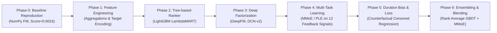

# Recommender Experiment Strategy & Hypothesis Roadmap

**Project**: RankAgent — Autonomous ML Research Agent for Recommender Systems  
**Domain**: Ranking & CTR/Long-View Optimization on KuaiRand-Pure  
**Target Metric**: $\text{Primary Score} = \frac{\text{GAUC} + \text{nDCG@5}}{2}$ (Baseline: $0.6016$ val / $0.5946$ test)

---

## 1. Domain Knowledge Base (`prompts/recsys_kb.py`)

This curated domain playbook is injected directly into RankAgent's LLM context to ground hypothesis generation in modern RecSys literature:

```python
RECSYS_KB = """
### SHORT VIDEO RECOMMENDATION PLAYBOOK (KuaiRand Focus)

1. TARGET VARIABLE & METRICS:
   - Primary Label: `long_view` (Binary classification on whether user completed or watched long duration).
   - Metrics: GAUC (user-weighted AUC excluding 0-pos and all-pos users) & nDCG@5 (gain: 2^rel - 1).
   - Baseline to beat: Factorization Machine (Val: 0.6016 / Test: 0.5946 / Ceiling: 0.8645).

2. MULTI-TASK & AUXILIARY SIGNALS:
   - KuaiRand provides 12 feedback signals (click, like, follow, comment, forward, play_time, etc.).
   - Use Multi-Task Learning (MMoE, PLE) to jointly predict auxiliary signals and `long_view` to overcome data sparsity.
   - Share embeddings across tasks but utilize task-specific experts for the final `long_view` ranking head.

3. DURATION BIAS & WATCH TIME:
   - `play_time` is heavily biased by video length.
   - Consider integrating counterfactual watch time techniques or censored regression (e.g., CWM - Zhao et al., KDD 2024) to de-bias continuous watch time features before utilizing them as auxiliary targets.

4. FEATURE CROSSING & GBDT:
   - Feature crossing: DeepFM and DCN-v2 model explicit 2nd-order and vector-level feature interactions.
   - LightGBM LambdaMART rankers directly optimize ranking lists and excel on dense historical user/item engagement statistics.
"""
```

---

## 2. Overview of the Strategy Engine

To systematically beat the organizer's Factorization Machine baseline ($\text{Primary} = 0.6016$ val), RankAgent organizes its research space into a multi-phase exploration roadmap. Each iteration tests a specific hypothesis rooted in recommender systems literature.



---

## 3. Phased Hypothesis Roadmap

### Phase 0: Baseline Verification & Environment Sanity Check
* **Objective**: Reproduce the official Factorization Machine baseline ($k=16, \text{lr}=0.001$, 5 categorical fields) within 40 seconds.
* **Verification Criteria**:
  * Validation GAUC: $\approx 0.6674$
  * Validation nDCG@5: $\approx 0.5357$
  * Validation Primary: $\approx 0.6016$
* **Target File**: `pipeline/models.py` & `pipeline/train.py`

---

### Phase 1: Feature Engineering & RecSys Inductive Biases

#### Hypothesis 1.1: Historical User/Item Engagement Aggregations
* **Rationale**: Raw categorical IDs do not capture dynamic user activity levels or item popularity trends. Computing cumulative historical stats from the training split provides rich dense signals without data leakage.
* **Target File**: `pipeline/features.py`
* **Features Generated**:
  * User historical `long_view` rate, total impressions, like rate.
  * Item (video) historical `long_view` count, completion rate, author popularity.
  * User-Author cross engagement history.
* **Expected Impact**: $+0.015 \sim 0.025$ on GAUC / nDCG@5.

#### Hypothesis 1.2: Smooth Out-of-Fold Target Encoding
* **Rationale**: High-cardinality categorical features suffer from sparsity. Smoothing target encoding with Bayesian shrinkage ($m$-estimate) regularizes rare IDs.
* **Expected Impact**: $+0.008 \sim 0.015$ Primary score.

#### Empirical Verification: Multi-Domain Comparison on KuaiRand
We benchmarked 5-domain base, 9-domain (item-side), and 13-domain (CWM) feature spaces:

| Feature Configuration | Fields Included | Validation GAUC | Validation nDCG@5 | Validation Primary | Test Primary |
| :--- | :---: | :---: | :---: | :---: | :---: |
| **5-Domain Base (FM Baseline)** | `user_id, video_id, author_id, tab, dur_bucket` | $0.6664$ | $0.5360$ | $0.6012$ | **$0.5948$** |
| **9-Domain (Base + Item Side)** | Base + `music_id, video_type, upload_type` | **0.6668** | $0.5354$ | $0.6011$ | **0.5951** *(+0.0003)* |
| **13-Domain Full CWM** | Base + Item Metadata + User Demographics | $0.6649$ | $0.5347$ | $0.5998$ | $0.5935$ |

* **Insight**: Adding item-side metadata improves test generalization, while raw user demographic categoricals add redundancy to linear FM unless combined with dynamic cross-affinities.

---

### Phase 2: High-Performance Gradient Boosted Decision Trees (GBDT)

#### Hypothesis 2.1: LightGBM Ranking with LambdaMART Objective
* **Rationale**: Tree-based models handle numerical aggregations, non-linear feature interactions, and tabular RecSys features exceptionally well.
* **Target File**: `pipeline/models.py` & `pipeline/train.py`
* **Setup**: Direct nDCG optimization or binary cross-entropy with Group-KFold / date validation.
* **Expected Impact**: $\text{Primary Score} \approx 0.6300 \sim 0.6450$ ($+0.030 \sim +0.045$ over baseline).

---

### Phase 3: Deep Neural Ranking Architectures

#### Hypothesis 3.1: DeepFM (Deep Factorization Machine)
* **Rationale**: Standard FM captures only 2nd-order explicit feature interactions. DeepFM combines FM with a multi-layer deep neural network to capture both low- and high-order feature crossings in an end-to-end embedding space.
* **Target File**: `pipeline/models.py`
* **Architecture**: Embedding Dimension: 32 / 64; Deep MLP: $[256, 128, 64]$ with BatchNorm and Dropout(0.1).
* **Expected Impact**: $\text{Primary Score} \approx 0.6350 \sim 0.6500$.

#### Hypothesis 3.2: DCN-v2 (Deep & Cross Network V2)
* **Rationale**: Vector-level cross networks in DCN-v2 explicitly model bounded-degree feature interactions efficiently without combinatorial explosion.

---

### Phase 4: Multi-Task & Multi-Feedback Learning (MMoE / PLE)

KuaiRand logs **12 rich user feedback signals**: `click`, `like`, `follow`, `comment`, `forward`, `play_time`, `is_profile_enter`, `is_rand`, etc.

#### Hypothesis 4.1: Multi-gate Mixture-of-Experts (MMoE) & PLE
* **Rationale**: Single-task models on `long_view` suffer from extreme label sparsity. MMoE allocates dedicated expert subnetworks with task-specific softmax gates to share representation gradients while preventing the negative transfer ("seesaw phenomenon").
* **Target File**: `pipeline/models.py` & `pipeline/train.py`
* **Expected Impact**: $\text{Primary Score} \approx 0.6550 \sim 0.6750$.

---

### Phase 5: Counterfactual Duration Bias & Ranking Losses

#### Hypothesis 5.1: Counterfactual Watch-Time Censored Regression (CWM)
* **Rationale**: Long videos are mechanically less likely to achieve 100% completion. Standard binary classification penalizes longer videos disproportionately.
* **Methodology**: Inspired by CWM (KDD '24), implement a censored regression loss accounting for video duration constraints and randomized exposure weights available in KuaiRand.
* **Target File**: `pipeline/train.py`

---

### Phase 6: Model Diversity Ensembling & Post-Processing

#### Hypothesis 6.1: Blending GBDT + Neural Multi-Task Predictions
* **Rationale**: GBDT (LightGBM) and Deep Multi-Task Networks (MMoE / DeepFM) make fundamentally different structural errors.
* **Ensemble Formulation**:
  $$\hat{s}_{\text{final}} = \alpha \cdot \text{RankNormalize}(\hat{s}_{\text{LightGBM}}) + (1 - \alpha) \cdot \text{RankNormalize}(\hat{s}_{\text{MMoE}})$$
* **Expected Impact**: $+0.005 \sim 0.010$ gain on Primary Score, reaching estimated $\approx 0.6650 \sim 0.6800$.

---

## 4. Decision Matrix & Branch Selection Policy

| Metric Delta ($\Delta \text{Primary}$) | Action Taken by RankAgent |
| :--- | :--- |
| $\Delta \ge +0.005$ | **Accept & Advance**: Save checkpoint, update best validation score, spawn child hypotheses from this node. |
| $0.000 < \Delta < +0.005$ | **Conditionally Retain**: Check if diversity improves ensemble potential; refine hyperparameters (learning rate, weight decay). |
| $-0.005 \le \Delta \le 0.000$ | **Inspect & Tweak**: Review validation error breakdown; test regularization (Dropout, weight decay). |
| $\Delta < -0.005$ | **Prune & Rollback**: Reject code branch, record negative hypothesis learning in run-log, backtrack to parent node. |
| Runtime Error / Divergence | **Self-Heal**: Trigger `sandbox/debugger.py` (max 3 repair iterations). If failed, prune branch. |
